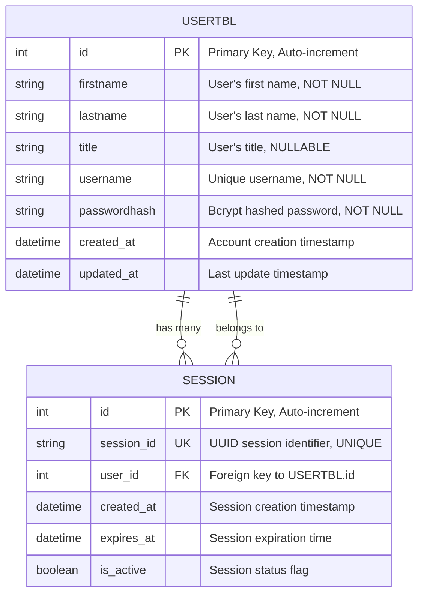
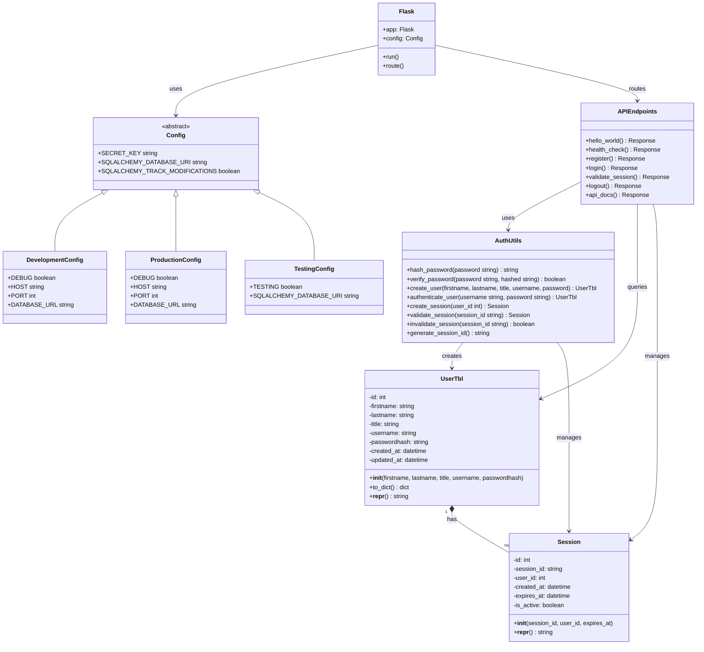
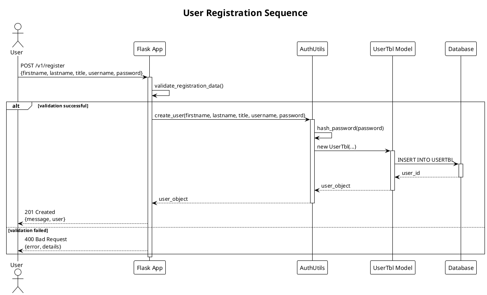
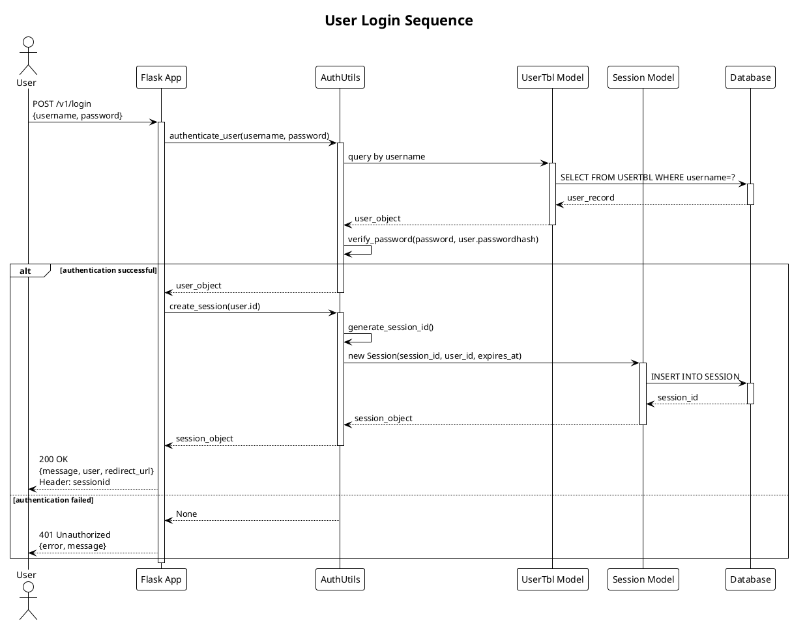
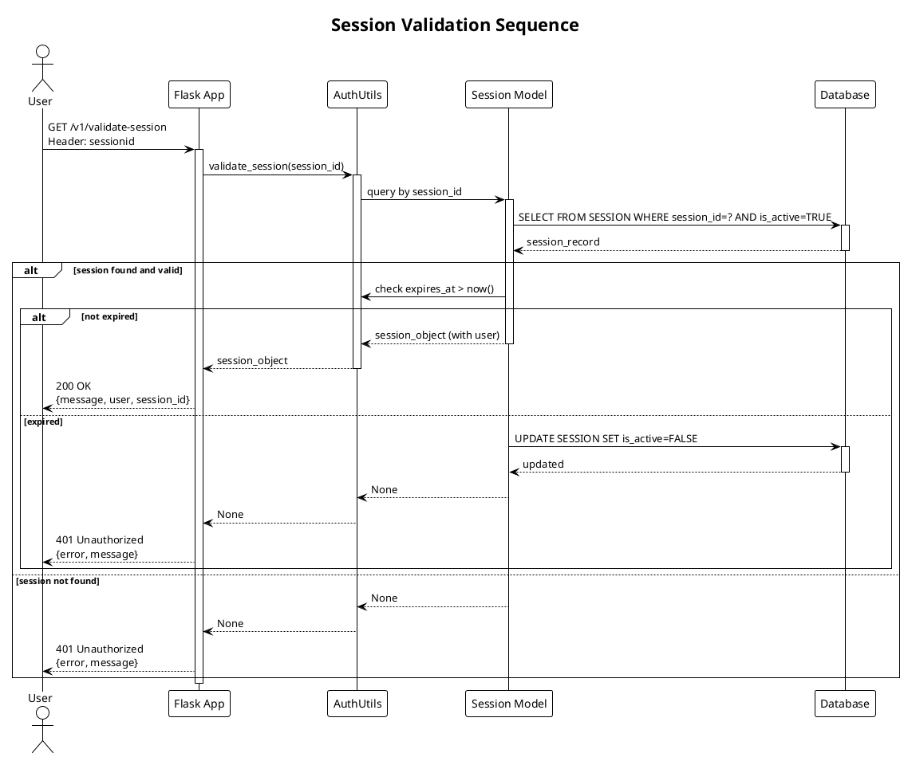
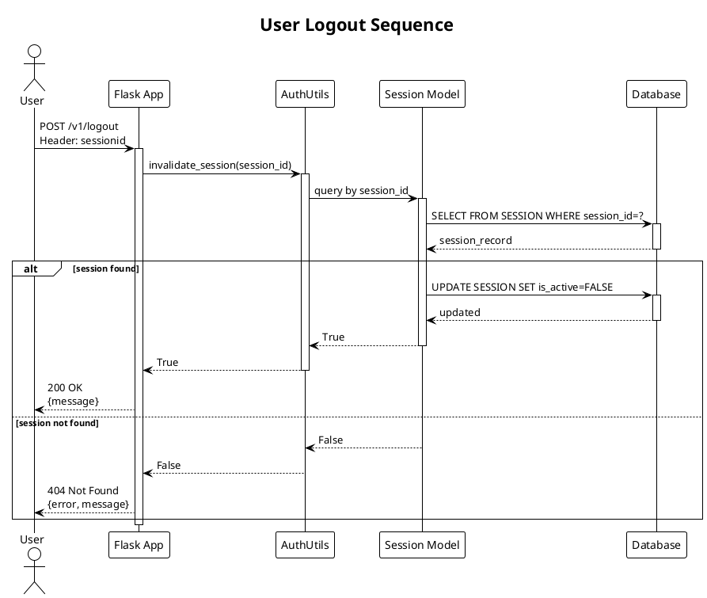
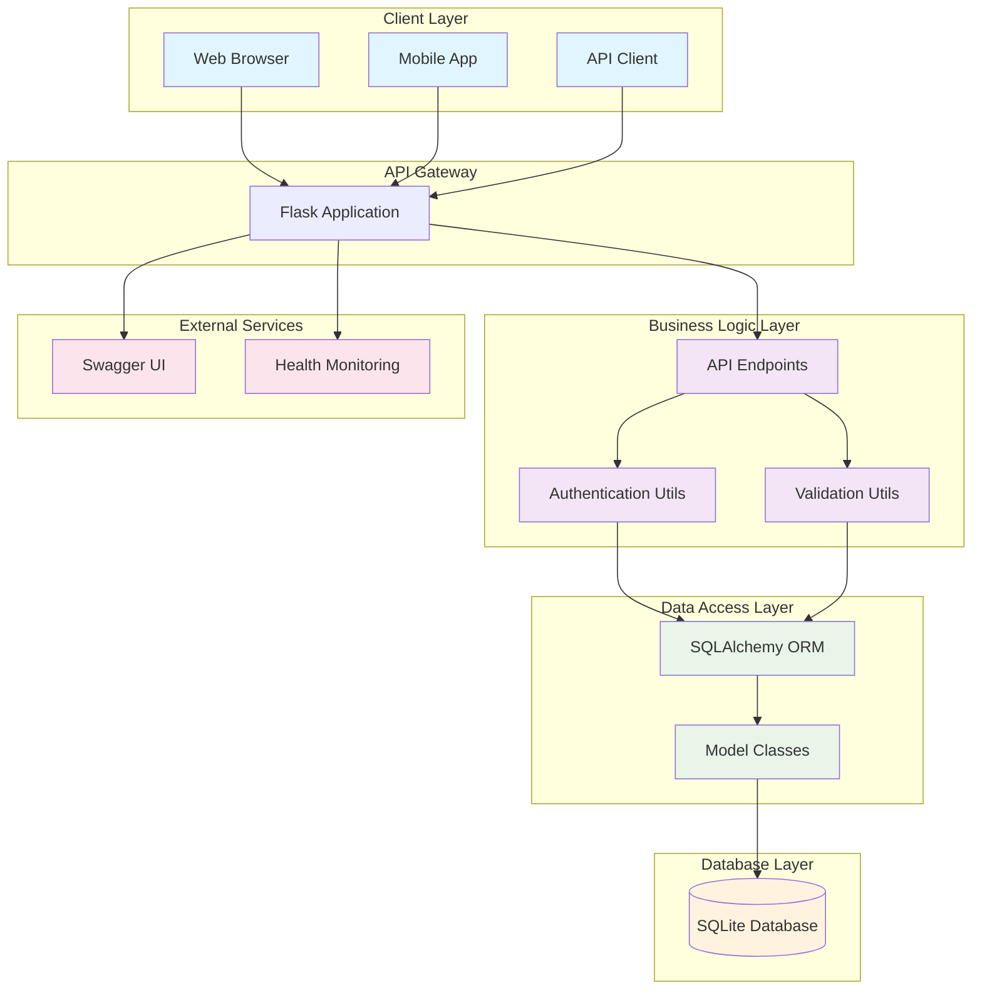
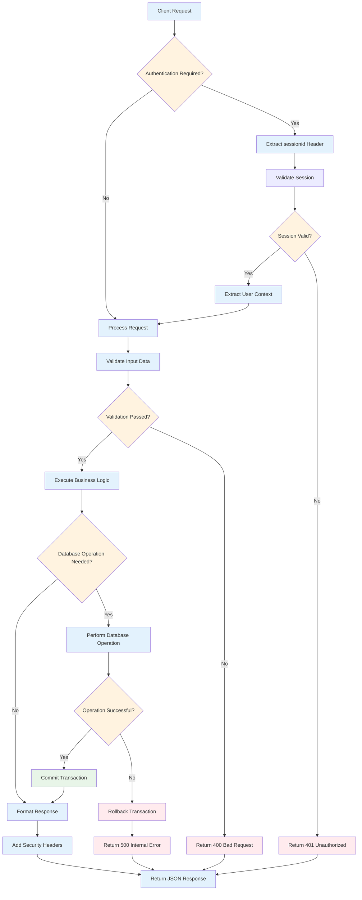
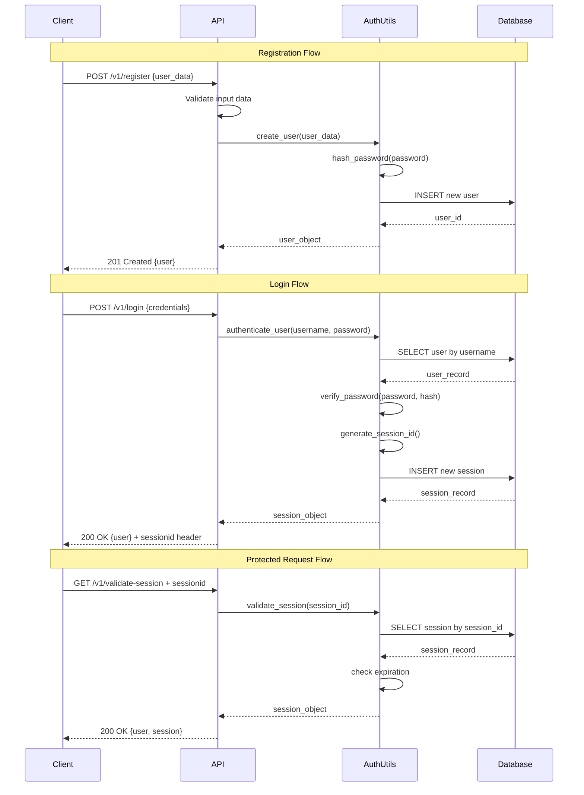

# 📊 Technical Details - KBTG Backend API

> Comprehensive technical documentation including database schema, system architecture, and UML diagrams

## 📋 Table of Contents

- [Database Design](#database-design)
- [Entity Relationship Diagram](#entity-relationship-diagram)
- [Class Diagram](#class-diagram)
- [Sequence Diagrams](#sequence-diagrams)
- [System Architecture](#system-architecture)
- [Data Flow](#data-flow)

---

## 🗄️ Database Design

### Database Schema Overview

The application uses SQLite database with two main tables for user management and session tracking:

#### Tables:
1. **USERTBL** - Stores user account information
2. **SESSION** - Manages user authentication sessions

### Database Relationships
- One-to-Many: UserTbl → Session (One user can have multiple sessions)
- Foreign Key: SESSION.user_id references USERTBL.id

---

## 🔗 Entity Relationship Diagram

### Field Specifications

**USERTBL Table:**
- `id`: INTEGER, Primary Key, Auto-increment
- `firstname`: VARCHAR(100), NOT NULL
- `lastname`: VARCHAR(100), NOT NULL  
- `title`: VARCHAR(50), NULLABLE
- `username`: VARCHAR(80), UNIQUE, NOT NULL
- `passwordhash`: VARCHAR(128), NOT NULL
- `created_at`: DATETIME, DEFAULT CURRENT_TIMESTAMP
- `updated_at`: DATETIME, DEFAULT CURRENT_TIMESTAMP ON UPDATE

**SESSION Table:**
- `id`: INTEGER, Primary Key, Auto-increment
- `session_id`: VARCHAR(36), UNIQUE, NOT NULL (UUID format)
- `user_id`: INTEGER, Foreign Key → USERTBL.id, NOT NULL
- `created_at`: DATETIME, DEFAULT CURRENT_TIMESTAMP
- `expires_at`: DATETIME, NULLABLE
- `is_active`: BOOLEAN, DEFAULT TRUE

---

## 📐 Class Diagram

### Class Descriptions

**Model Classes:**
- `UserTbl`: SQLAlchemy model for user data with validation and serialization
- `Session`: SQLAlchemy model for session management with expiration tracking

**Utility Classes:**
- `AuthUtils`: Static utility class for authentication operations (bcrypt hashing, session management)
- `Config`: Abstract base configuration class with environment-specific implementations

**Application Classes:**
- `Flask`: Main application instance with route definitions
- `APIEndpoints`: Logical grouping of all API endpoint functions

---

## 🔄 Sequence Diagrams

### User Registration Flow

### User Login Flow

### Session Validation Flow

### User Logout Flow

---

## 🏗️ System Architecture

### High-Level Architecture

### Component Responsibilities

**Client Layer:**
- Web browsers, mobile apps, and API clients
- Responsible for user interaction and API consumption

**API Gateway:**
- Flask application serving as the main entry point
- Handles HTTP requests/responses and routing

**Business Logic Layer:**
- `AuthUtils`: Password hashing, user authentication, session management
- `ValidationUtils`: Input validation and data sanitization
- `APIEndpoints`: Request handling and response formatting

**Data Access Layer:**
- `SQLAlchemy ORM`: Object-relational mapping and database abstraction
- `Model Classes`: Data models with business logic and relationships

**Database Layer:**
- SQLite database for data persistence
- Handles ACID transactions and data integrity

---

## 🌊 Data Flow

### Request Processing Flow

### Authentication Data Flow

---

## 🔧 Technical Implementation Notes

### Security Considerations
- **Password Hashing**: Using bcrypt with automatic salt generation
- **Session Management**: UUID-based tokens with configurable expiration
- **SQL Injection Prevention**: Parameterized queries through SQLAlchemy ORM
- **Input Validation**: Comprehensive validation on all endpoints
- **Error Handling**: Sanitized error messages without sensitive information

### Performance Optimizations
- **Database Indexing**: Unique indexes on username and session_id
- **Session Cleanup**: Automatic expiration handling
- **Connection Pooling**: SQLAlchemy connection management
- **Lazy Loading**: Efficient database queries with relationships

### Scalability Considerations
- **Stateless Design**: Session data stored in database, not memory
- **Database Migration Support**: SQLAlchemy Alembic integration ready
- **Configuration Management**: Environment-based configuration
- **Containerization**: Docker support for easy deployment

---

*This technical documentation provides comprehensive details about the system architecture, data models, and implementation patterns used in the KBTG Backend API project.*
